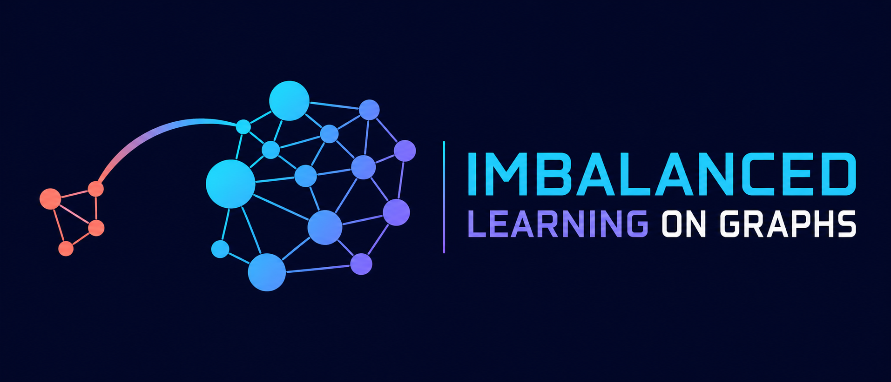

# Awesome Imbalanced Learning on Graphs

[](https://awesome.re)
[](https://opensource.org/licenses/MIT)
[](#citation)

> A curated collection of surveys, papers, and code for imbalanced learning on graphs.

Imbalanced graph learning studies how to learn effectively when graph data is
skewed across classes, node degrees, topology, communities, or graph sizes. This
list organizes recent work by imbalance type and learning strategy.

<p align="center">
  
</p>

## Contents

- [Surveys](#surveys)
- [Node-level imbalance](#node-level-imbalance)
  - [Quantity imbalance](#quantity-imbalance)
    - [Data augmentation](#data-augmentation)
    - [Oversampling](#oversampling)
    - [Loss function engineering](#loss-function-engineering)
    - [Knowledge distillation](#knowledge-distillation)
    - [Self-supervised learning](#self-supervised-learning)
    - [Reinforcement learning](#reinforcement-learning)
  - [Community bias](#community-bias)
  - [Degree imbalance](#degree-imbalance)
  - [Topology imbalance](#topology-imbalance)
- [Graph-level imbalance](#graph-level-imbalance)
  - [Graph classification](#graph-classification)
  - [Graph size imbalance](#graph-size-imbalance)
- [Multimodal learning](#multimodal-learning)
- [Citation](#citation)
- [Contributing](#contributing)
- [Contact](#contact)

## Surveys

**A Survey of Graph Neural Networks in Real World: Imbalance, Noise, Privacy and OOD Challenges**
> *Wei Ju, Siyu Yi, Yifan Wang, Zhiping Xiao, Zhengyang Mao, Hourun Li, Yiyang Gu, Yifang Qin, Nan Yin, Senzhang Wang, Xinwang Liu, Philip S. Yu, Ming Zhang* \
> IEEE TPAMI 2025. [[paper](https://doi.org/10.1109/TPAMI.2025.3630673)] [[preprint](https://arxiv.org/abs/2403.04468)]\
> 2025

**A Survey of Imbalanced Learning on Graphs: Problems, Techniques, and Future Directions**
> *Zemin Liu, Yuan Li, Nan Chen, Qian Wang, Bryan Hooi, Bingsheng He* \
> IEEE TKDE 2025. [[paper](https://doi.org/10.1109/TKDE.2025.3549299)] [[preprint](https://arxiv.org/abs/2308.13821)]\
> 2025

**Class-Imbalanced Learning on Graphs: A Survey**
> *Yihong Ma, Yijun Tian, Nuno Moniz, Nitesh V. Chawla* \
> ACM Computing Surveys 2025. [[paper](https://doi.org/10.1145/3718734)] [[preprint](https://arxiv.org/abs/2304.04300)]\
> 2025

**IGL-Bench: Establishing the Comprehensive Benchmark for Imbalanced Graph Learning**
> *Jiawen Qin, Haonan Yuan, Qingyun Sun, Lyujin Xu, Jiaqi Yuan, Pengfeng Huang, Zhaonan Wang, Xingcheng Fu, Hao Peng, Jianxin Li, Philip S. Yu* \
> ICLR 2025. [[paper](https://proceedings.iclr.cc/paper_files/paper/2025/hash/05b69cc4c8ff6e24c5de1ecd27223d37-Abstract-Conference.html)] [[code](https://github.com/RingBDStack/IGL-Bench)]\
> 2025

## Node-level imbalance

### Quantity imbalance

#### Data augmentation

**GraphST: Class-Imbalanced Node Classification with Semantic Relation Transfer**
> *Jialong Wang, Quanlong Guan, Lianbing Deng, Mengting Zhou, Zhiguo Gong* \
> Pattern Recognition 2026. [[paper](https://doi.org/10.1016/j.patcog.2025.112626)]\
> Apr 2026

**GraphSB: Boosting Imbalanced Node Classification on Graphs through Structural Balance**
> *Zhixiao Wang, Chaofan Zhu, Qihan Feng, Jian Zhang, Xiaobin Rui, Philip S. Yu* \
> arXiv 2026. [[paper](https://arxiv.org/abs/2601.19352)]\
> 27 Jan 2026

**GraphIFE: Rethinking Graph Imbalance Node Classification via Invariant Learning**
> *Fanlong Zeng, Wensheng Gan, Philip S. Yu* \
> arXiv 2025. [[paper](https://arxiv.org/abs/2509.23616)]\
> 28 Sep 2025

**Dual Prototype-Enhanced Contrastive Framework for Class-Imbalanced Graph Domain Adaptation**
> *Xin Ma, Yifan Wang, Siyu Yi, Wei Ju, Junyu Luo, Yusheng Zhao, Xiao Luo, Jiancheng Lv* \
> NeurIPS 2025. [[paper](https://proceedings.neurips.cc/paper_files/paper/2025/hash/455b24e256981fb97f7a650993c35c98-Abstract-Conference.html)] [[code](https://github.com/maxin88scu/ImGDA)]\
> 2025

**Class-Imbalanced Graph Learning without Class Rebalancing**
> *Zhining Liu, Ruizhong Qiu, Zhichen Zeng, Hyunsik Yoo, David Zhou, Zhe Xu, Yada Zhu, Kommy Weldemariam, Jingrui He, Hanghang Tong* \
> ICML 2024. [[paper](https://openreview.net/forum?id=pPnkpvBeZN)] [[code](https://github.com/ZhiningLiu1998/BAT)]\
> 2 May 2024

**BuffGraph: Enhancing Class-Imbalanced Node Classification via Buffer Nodes**
> *Qian Wang, Zemin Liu, Zhen Zhang, Bingsheng He* \
> arXiv 2024. [[paper](https://arxiv.org/abs/2402.13114)]\
> 20 Feb 2024

**Rethinking Semi-Supervised Imbalanced Node Classification from Bias-Variance Decomposition**
> *Divin Yan, Gengchen Wei, Chen Yang, Shengzhong Zhang, Zengfeng Huang* \
> NeurIPS 2023. [[paper](https://arxiv.org/abs/2310.18765)] [[code](https://github.com/yanliang3612/ReVar)]\
> 21 Sep 2023

**Imbalanced Node Classification Beyond Homophilic Assumption**
> *Jie Liu, Mengting He, Guangtao Wang, Nguyen Quoc Viet Hung, Xuequn Shang, Hongzhi Yin* \
> arXiv 2023. [[paper](https://arxiv.org/abs/2304.14635)]\
> 28 Apr 2023

#### Oversampling

**GraphUAT: An Uncertainty-Driven Pseudo-Labeling Method for Class-Imbalanced Node Classification**
> *Bingjie Niu, Gen Liu, Kun Liu, Qi Meng, Chao Li, Zhongying Zhao* \
> Expert Systems with Applications 2026. [[paper](https://doi.org/10.1016/j.eswa.2026.133450)] [[code](https://github.com/ZZY-GraphMiningLab/GraphUAT)]\
> 2026

**Multi-Motif Enhanced Node Representation Generation for Class-Imbalanced Node Classification**
> *Jiashuo Zheng, Hongshan Pu, Ye Liu* \
> Neurocomputing 2026. [[paper](https://doi.org/10.1016/j.neucom.2026.133903)]\
> 13 May 2026

**IMMix: Class-Imbalanced Node Classification via Prototypical Selective Mixup Augmentation**
> *Jiawen Qin, Qingyun Sun, Lyujin Xu, Cheng Ji, Jianxin Li* \
> Pattern Recognition 2026. [[paper](https://doi.org/10.1016/j.patcog.2025.112749)]\
> Apr 2026

**A Multi-View Graph Neural Network with Subgraph Variational Autoencoder for Class-Imbalanced Node Classification**
> *Longqing Du, Zhirong Huang, Jiecheng Li, Guixian Zhang, Debo Cheng, Guangquan Lu, Shichao Zhang* \
> Knowledge-Based Systems 2026. [[paper](https://doi.org/10.1016/j.knosys.2025.115081)]\
> 15 Feb 2026

**GraphBSSN: A Simple yet Effective Generative Method for Node Classification in Class-Imbalanced Graphs**
> *Qi Meng, Gen Liu, Guangkai Wu, Hui Zhou, Zhongying Zhao* \
> Knowledge-Based Systems 2025. [[paper](https://doi.org/10.1016/j.knosys.2025.114175)] [[code](https://github.com/ZZY-GraphMiningLab/GraphBSSN)]\
> 2025

**Iceberg: Debiased self-training for class-imbalanced node classification**
> *Zhixun Li, Dingshuo Chen, Tong Zhao, Daixin Wang, Hongrui Liu, Zhiqiang Zhang, Jun Zhou, Jeffrey Xu Yu* \
> WWW 2025. [[paper](https://arxiv.org/abs/2502.06280)] [[code](https://github.com/ZhixunLEE/IceBerg)]\
> 10 Feb 2025

**Overcoming Class Imbalance: Unified GNN Learning with Structural and Semantic Connectivity Representations**
> *Abdullah Alchihabi, Hao Yan, Yuhong Guo* \
> arXiv 2024. [[paper](https://arxiv.org/abs/2412.20656)]\
> 30 Dec 2024

**VIGraph: Generative Self-Supervised Learning for Class-Imbalanced Node Classification**
> *Yulan Hu, Sheng Ouyang, Zhirui Yang, Yong Liu* \
> arXiv 2023. [[paper](https://arxiv.org/abs/2311.01191)]\
> 2 Nov 2023

**INS-GNN: Improving graph imbalance learning with self-supervision**
> *Xin Juan, Fengfeng Zhou, Wentao Wang, Wei Jin, Jiliang Tang, Xin Wang* \
> Information Sciences. [[paper](https://www.sciencedirect.com/science/article/abs/pii/S0020025523005042)]\
> 30 Aug 2023

**GraphSHA: Synthesizing Harder Samples for Class-Imbalanced Node Classification**
> *Wen-Zhi Li, Chang-Dong Wang, Hui Xiong, Jian-Huang Lai* \
> KDD 2023. [[paper](https://arxiv.org/abs/2306.09612)]\
> 16 Jun 2023

**Semantic-aware Node Synthesis for Imbalanced Heterogeneous Information Networks**
> *Xinyi Gao, Wentao Zhang, Tong Chen, Junliang Yu, Hung Quoc Viet Nguyen, Hongzhi Yin* \
> CIKM 2023. [[paper](https://dl.acm.org/doi/10.1145/3583780.3615055)]\
> 27 Feb 2023

**GraphSR: A Data Augmentation Algorithm for Imbalanced Node Classification**
> *Mengting Zhou, Zhiguo Gong* \
> AAAI 2023. [[paper](https://arxiv.org/abs/2302.12814)]\
> 24 Feb 2023

**UNREAL: Unlabled Nodes Retrieval and Labeling for Heavily-imbalanced Node Classification**
> *Divin Yan, Shengzhong Zhang, Bisheng Li, Min Zhou, Zengfeng Huang* \
> Openreview 2022. [[paper](https://arxiv.org/abs/2303.10371)]\
> 30 Sep 2022

**GraphENS: Neighbor-aware ego network synthesis for class-imbalanced node classification**
> *Joonhyung Park<sup>1</sup>, Jaeyun Song<sup>1</sup>, Eunho Yang* \
> ICLR 2022. [[paper](https://openreview.net/forum?id=MXEl7i-iru)] [[code](https://github.com/JoonHyung-Park/GraphENS)]\
> 18 Aug 2022

**A Graph Neural Network-Based Node Classification Model on Class-Imbalanced Graph Data**
> *Zhenhua Huang, Yinhao Tang, Yunwen Chen* \
> Knowledge-Based Systems 2022. [[paper](https://doi.org/10.1016/j.knosys.2022.108538)]\
> 23 May 2022

**Graph Neural Network with Curriculum Learning for Imbalanced Node Classification**
> *Xiaohe Li, Lijie Wen, Yawen Deng, Fuli Feng, Xuming Hu, Lei Wang, Zide Fan* \
> arXiv 2022. [[paper](https://arxiv.org/abs/2202.02529)]\
> 5 Feb 2022

**GraphMixup: Improving Class-Imbalanced Node Classification on Graphs by Self-supervised Context Prediction**
> *Lirong Wu, Haitao Lin, Zhangyang Gao, Cheng Tan, Stan.Z.Li* \
> ECML-PKDD 2022. [[paper](https://arxiv.org/abs/2106.11133)] [[code](https://github.com/LirongWu/GraphMixup)] \
> 21 Jun 2021

**ImGAGN:Imbalanced Network Embedding via Generative Adversarial Graph Networks**
> *Liang Qu, Huaisheng Zhu, Ruiqi Zheng, Yuhui Shi, Hongzhi Yin* \
> KDD 2021. [[paper](https://arxiv.org/abs/2106.02817)] [[code](https://github.com/Leo-Q-316/ImGAGN)]\
> 05 Jun 2021

**GraphSMOTE: Imbalanced Node Classification on Graphs with Graph Neural Networks**
> *Tianxiang Zhao, Xiang Zhang, Suhang Wang,* \
> WSDM 2021. [[paper](https://arxiv.org/abs/2103.08826)] [[code](https://github.com/TianxiangZhao/GraphSmote)]\
> 16 Mar 2021

**Multi-Class Imbalanced Graph Convolutional Network Learning**
> *Min Shi, Yufei Tang, Xingquan Zhu, David Wilson, Jianxun Liu* \
> IJCAI 2020. [[paper](https://arxiv.org/abs/2210.05274)] [[code](https://github.com/codeshareabc/DRGCN)] \
> 07 Jan 2021

#### Loss function engineering

**NodeImport: Imbalanced Node Classification with Node Importance Assessment**
> *Nan Chen, Zemin Liu, Bryan Hooi, Bingsheng He, Jun Hu, Jia Chen* \
> KDD 2025. [[paper](https://dl.acm.org/doi/10.1145/3690624.3709215)] [[code](https://github.com/NanChanNN/NodeImport)]\
> 20 July 2025

**REFUEL: Rule Extraction for Imbalanced Neural Node Classification**
> *Marco Markwald, Elena Demidova* \
> Machine Learning 2024. [[paper](https://doi.org/10.1007/s10994-024-06569-0)] [[code](https://github.com/MarcoMarkwald/REFUEL)]\
> 19 Jun 2024

**Automated Loss Function Search for Class-Imbalanced Node Classification**
> *Xinyu Guo, Kai Wu, Xiaoyu Zhang, Jing Liu* \
> ICML 2024. [[paper](https://openreview.net/forum?id=O1hmwi51pp)]\
> 2 May 2024

**Hyperbolic Geometric Graph Representation Learning for Hierarchy-imbalance Node Classification**
> *Xingcheng Fu, Yuecen Wei, Qingyun Sun, Haonan Yuan, Jia Wu, Hao Peng, Jianxin Li* \
> WWW 2023. [[paper](https://arxiv.org/abs/2304.05059)] \
> 11 Apr 2023

**Minority-Weighted Graph Neural Network for Imbalanced Node Classification in Social Networks of Internet of People**
> *Kefan Wang, Jing An, Mengchu Zhou, Zhe Shi, Xudong Shi, Qi Kang* \
> IEEE Internet of Things Journal. [[paper](https://ieeexplore.ieee.org/abstract/document/9875203)] \
> 01 Jun 2022

**TAM: Topology-Aware Margin Loss for Class-Imbalanced Node Classification**
> *Jaeyun Song<sup>1</sup>, Joonhyung Park<sup>1</sup>, Eunho Yang* \
> ICML 2022. [[paper](https://arxiv.org/abs/2206.01729)] [[code](https://github.com/Jaeyun-Song/TAM)] \
> 01 Jun 2022

**BA-GNN: On Learning Bias-Aware Graph Neural Network**
> *Zhengyu Chen, Teng Xiao, Kun Kuang* \
> ICDE 2022. [[paper](https://ieeexplore.ieee.org/document/9835653)]  \
> 09 May 2022

**FRAUDRE: Fraud Detection Dual-Resistant to Graph Inconsistency and Imbalance**
> *Ge Zhang, Jia Wu, Jian Yang, Amin Beheshti, Shan Xue, Chuan Zhou, Quan Z. Sheng* \
> ICDM 2021. [[paper](https://ieeexplore.ieee.org/document/9679178)] [[code](https://github.com/FraudDetection/FRAUDRE)] \
> 07 Dec 2021

**Boosting-GNN: Boosting Algorithm for Graph Networks on Imbalanced Node Classification**
> *Shuhao Shi, Kai Qiao, Shuai Yang, Linyuan Wang, Jian Chen, Bin Yan* \
> Frontiers in Neurorobotics 2021. [[paper](https://doi.org/10.3389/fnbot.2021.775688)]\
> 25 Nov 2021

#### Knowledge distillation

**LTE4G: Long-Tail Experts for Graph Neural Networks**
> *Sukwon Yun, Kibum Kim, Kanghoon Yoon, Chanyoung Park* \
> CIKM 2021. [[paper](https://arxiv.org/abs/2208.10205)] [[code](https://github.com/SukwonYun/LTE4G)] \
> 19 Apr 2022

#### Self-supervised learning

**Node Transfer with Graph Contrastive Learning for Class-Imbalanced Node Classification**
> *Yangding Li, Xiangchao Zhao, Yangyang Zeng, Hao Feng, Jiawei Chai, Hao Xie, Shaobin Fu, Shichao Zhang* \
> Neural Networks 2025. [[paper](https://doi.org/10.1016/j.neunet.2025.107674)]\
> Oct 2025

**Co-Modality Graph Contrastive Learning for Imbalanced Node Classification**
> *Yiyue Qian, Chunhui Zhang, Yiming Zhang, Qianlong Wen, Yanfang Ye, Chuxu Zhang* \
> NeurIPS 2022. [[paper](https://openreview.net/forum?id=f_kvHrM4Q0)] [[code](https://github.com/graphprojects/CM-GCL)] \
> 01 Nov 2022

**Diving into Unified Data-Model Sparsity for Class-Imbalanced Graph Representation Learning**
> *Chunhui Zhang, Chao Huang, Yijun Tian, Qianlong Wen, Zhongyu Ouyang, Youhuan Li, Yanfang Ye, Chuxu Zhang* \
> NeurIPS GLFrontiers Workshop 2022. [[paper](https://arxiv.org/abs/2210.00162)]\
> 1 Oct 2022

**ImGCL: Revisiting Graph Contrastive Learning on Imbalanced Node Classification**
> *Liang Zeng, Lanqing Li, Ziqi Gao, Peilin Zhao, Jian Li* \
> arXiv 2022. [[paper](https://arxiv.org/abs/2205.11332)]\
> 23 May 2022

**Distance-wise Prototypical Graph Neural Network in Node Imbalance Classification**
> *Yu Wang, Charu Aggarwal, Tyler Derr* \
> arXiv 2021. [[paper](https://arxiv.org/abs/2110.12035)] [[code](https://github.com/YuWVandy/DPGNN)] \
> 19 Apr 2022

#### Reinforcement learning

**AUC-oriented Graph Neural Network for Fraud Detection**
> *Mengda Huang , Yang Liu , Xiang Ao , Kuan Li , Jianfeng Chi , Jinghua Feng , Hao Yang , Qing He* \
> WWW 2022. [[paper](https://dl.acm.org/doi/10.1145/3485447.3512178)] \
> 25 Apr 2022

### Community bias

**Understanding Community Bias Amplification in Graph Representation Learning**
> *Shengzhong Zhang, Wenjie Yang, Yimin Zhang, Hongwei Zhang, Divin Yan, Zengfeng Huang* \
> arXiv 2023. [[paper](https://arxiv.org/abs/2312.04883)]\
> 8 Dec 2023

### Degree imbalance

#### Semi-supervised learning

**Toward Degree Bias in Embedding-Based Knowledge Graph Completion**
> *Harry Shomer, Wei Jin, Wentao Wang, Jiliang Tang* \
> WWW 2023. [[paper](https://arxiv.org/abs/2302.05044)]\
> 10 Feb 2023

**ResNorm: Tackling Long-tailed Degree Distribution Issue in Graph Neural Networks via Normalization**
> *Langzhang Liang, Zenglin Xu, Zixing Song, Irwin King, Jieping Ye* \
> arXiv 2022. [[paper](https://arxiv.org/abs/2206.08181)]\
> 16 Jun 2022

**BA-GNN: On Learning Bias-Aware Graph Neural Network**
> *Zhengyu Chen, Teng Xiao, Kun Kuang* \
> ICDE 2022. [[paper](https://ieeexplore.ieee.org/document/9835653)]  \
> 09 May 2022

**LTE4G: Long-Tail Experts for Graph Neural Networks**
> *Sukwon Yun, Kibum Kim, Kanghoon Yoon, Chanyoung Park* \
> CIKM 2021. [[paper](https://arxiv.org/abs/2208.10205)] [[code](https://github.com/SukwonYun/LTE4G)] \
> 19 Apr 2022

**RawlsGCN: Towards Rawlsian Difference Principle on Graph Convolutional Network**
> *Jian Kang, Yan Zhu, Yinglong Xia, Jiebo Luo, Hanghang Tong* \
> WWW 2022. [[paper](https://arxiv.org/abs/2202.13547)] [[code](https://github.com/jiank2/RawlsGCN)]\
> 28 Feb 2022

**Bilateral Filtering Graph Convolutional Network for Multi-relational Social Recommendation in the Power-law Networks**
> *Minghao Zhao, Qilin Deng, Kai Wang, Runze Wu, Jianrong Tao, Changjie Fan, Liang Chen, Peng Cui* \
> TOIS 2021. [[paper](https://dl.acm.org/doi/10.1145/3469799)]\
> 21 Sep 2021

**Tail-GNN: Tail-Node Graph Neural Networks**
> *Zemin Liu, Trung-Kien Nguyen, Yuan Fang* \
> KDD 2021. [[paper](https://dl.acm.org/doi/10.1145/3447548.3467276)] [[code](https://github.com/shuaiOKshuai/Tail-GNN)]\
> 14 Aug 2021

**Towards locality-aware meta-learning of tail node embeddings on networks**
> *Zemin Liu, Wentao Zhang, Yuan Fang, Xinming Zhang, Steven C.H. Hoi* \
> CIKM 2020. [[paper](https://dl.acm.org/doi/10.1145/3340531.3411910)] [[code](https://github.com/smufang/meta-tail2vec)] \
> 19 Oct 2020

**Investigating and Mitigating Degree-Related Biases in Graph Convolutional Networks**
> *Xianfeng Tang, Huaxiu Yao, Yiwei Sun, Yiqi Wang, Jiliang Tang, Charu Aggarwal, Prasenjit Mitra, Suhang Wang* \
> CIKM 2020. [[paper](https://arxiv.org/abs/2006.15643)]\
> 28 Jun 2020

#### Unsupervised learning

**Uncovering the Structural Fairness in Graph Contrastive Learning**
> *Ruijia Wang, Xiao Wang, Chuan Shi, Le Song* \
> NeurIPS 2022. [[paper](https://arxiv.org/abs/2210.03011)] [[code](https://github.com/BUPT-GAMMA/Uncovering-the-Structural-Fairness-in-Graph-Contrastive-Learning)]\
> 06 Oct 2022

### Topology imbalance

**Topology Uncertainty Modeling For Imbalanced Node Classification on Graphs**
> *Jiayi Gao, Jiaxing Li, Ke Zhang, Youyong Kong*\
> ICASSP 2023. [[paper](https://ieeexplore.ieee.org/abstract/document/10094813)]\
> 05 May 2023

**TopoImb: Toward Topology-level Imbalance in Learning from Graphs**
> *Tianxiang Zhao, Dongsheng Luo, Xiang Zhang, Suhang Wang*\
> LOG 2022. [[paper](https://openreview.net/forum?id=nR3rZ4ODtQ)]\
> 23 Nov 2022

**Position-aware Structure Learning for Graph Topology-imbalance by Relieving Under-reaching and Over-squashing**
> *Qingyun Sun, Jianxin Li, Haonan Yuan, Xingcheng Fu, Hao Peng, Cheng Ji, Qian Li, Philip S. Yu*\
> CIKM 2022. [[paper](https://arxiv.org/abs/2208.08302)] [[code](https://github.com/RingBDStack/PASTEL)] \
> 17 Aug 2022

**Topology-Imbalance Learning for Semi-Supervised Node Classification**
> *Deli Chen, Yankai Lin, Guangxiang Zhao, Xuancheng Ren, Peng Li, Jie Zhou, Xu Sun*\
> NeurIPS 2021. [[paper](https://arxiv.org/abs/2110.04099)] [[code](https://github.com/victorchen96/ReNode)] \
> 08 Oct 2021

## Graph-level imbalance

### Graph classification

**Cluster-Guided Contrastive Class-Imbalanced Graph Classification**
> *Wei Ju, Zhengyang Mao, Siyu Yi, Yifang Qin, Yiyang Gu, Zhiping Xiao, Jianhao Shen, Ziyue Qiao, Ming Zhang* \
> AAAI 2025. [[paper](https://doi.org/10.1609/aaai.v39i11.33298)]\
> 11 Apr 2025

**When Imbalance Meets Imbalance: Structure-driven Learning for Imbalanced Graph Classification**
> *Wei Xu, Pengkun Wang, Zhe Zhao, Binwu Wang, Xu Wang, Yang Wang* \
> WWW 2024. [[paper](https://dl.acm.org/doi/10.1145/3589334.3645629)]\
> 13 May 2024

**Towards Long-Tailed Recognition for Graph Classification via Collaborative Experts**
> *Siyu Yi, Zhengyang Mao, Wei Ju, Yongdao Zhou, Luchen Liu, Xiao Luo, Ming Zhang* \
> arXiv 2023. [[paper](https://arxiv.org/abs/2308.16609)]\
> 31 Aug 2023

**RAHNet: Retrieval Augmented Hybrid Network for Long-tailed Graph Classification**
> *Zhengyang Mao, Wei Ju, Yifang Qin, Xiao Luo, Ming Zhang* \
> ACM MM 2023. [[paper](https://dl.acm.org/doi/10.1145/3581783.3612360)]\
> 4 Aug 2023

**Imbalanced Graph Classification via Graph-of-Graph Neural Networks**
> *Yu Wang, Yuying Zhao, Neil Shah, Tyler Derr* \
> CIKM 2022. [[paper](https://dl.acm.org/doi/10.1145/3511808.3557356)] [[code](https://github.com/YuWVandy/G2GNN)]\
> 17 Oct 2022

### Graph size imbalance

**Graph Size-imbalanced Learning with Energy-guided Structural Smoothing**
> *Jiawen Qin, Pengfeng Huang, Qingyun Sun, Cheng Ji, Xingcheng Fu, Jianxin Li* \
> WSDM 2025. [[paper](https://arxiv.org/abs/2412.17591)] \
> 23 Dec 2024

**On Size-Oriented Long-Tailed Graph Classification of Graph Neural Networks**
> *Zemin Liu, Qiheng Mao, Chenghao Liu, Yuan Fang, Jianling Sun* \
> WWW 2022. [[paper](https://dl.acm.org/doi/10.1145/3485447.3512197)] [[code](https://github.com/shuaiOKshuai/SOLT-GNN)]\
> 25 Apr 2022

## Multimodal learning

**SaVe-TAG: LLM-Based Interpolation for Long-Tailed Text-Attributed Graphs**
> *Leyao Wang, Yu Wang, Bo Ni, Yuying Zhao, Hanyu Wang, Yao Ma, Tyler Derr* \
> KDD 2026. [[paper](https://arxiv.org/abs/2410.16882)]\
> 2026

**Co-Modality Graph Contrastive Learning for Imbalanced Node Classification**
> *Yiyue Qian, Chunhui Zhang, Yiming Zhang, Qianlong Wen, Yanfang Ye, Chuxu Zhang* \
> NeurIPS 2022. [[paper](https://openreview.net/forum?id=f_kvHrM4Q0)] [[code](https://github.com/graphprojects/CM-GCL)]\
> 15 Sept 2022

## Citation

If you find this repository useful, please cite it as follows:

```bibtex
@misc{yan2023awesomeimbalancedgraphs,
  author       = {Liang Yan},
  title        = {Awesome Imbalanced Learning on Graphs},
  year         = {2023},
  howpublished = {\url{https://github.com/yanliang3612/awesome-imbalanced-learning-on-graphs}},
  note         = {GitHub repository}
}
```

## Contributing

Contributions are welcome. To add a paper or code release, open a pull request or
an issue and include its title, authors, venue, publication date, paper link, and
code link when available. Please place new entries in the most relevant category
and order them from newest to oldest.

## Contact

[Liang Yan](https://divinyan.com) · [yanliangfdu@gmail.com](mailto:yanliangfdu@gmail.com)
